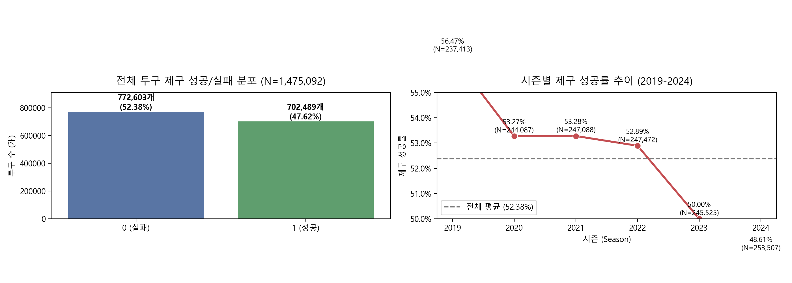
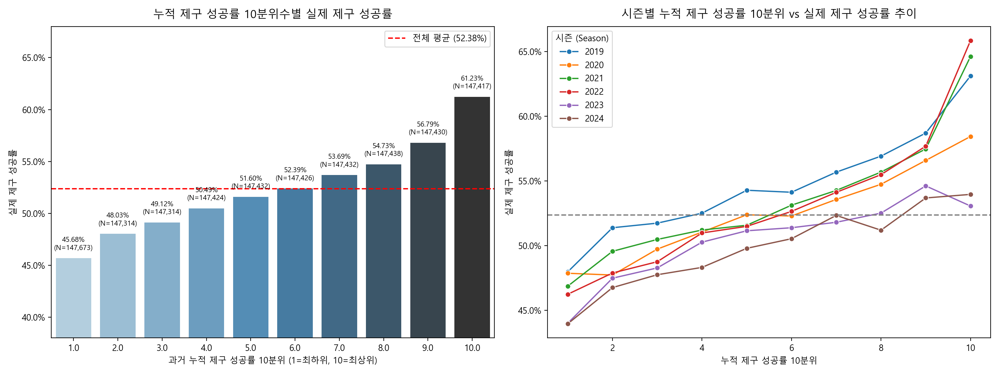
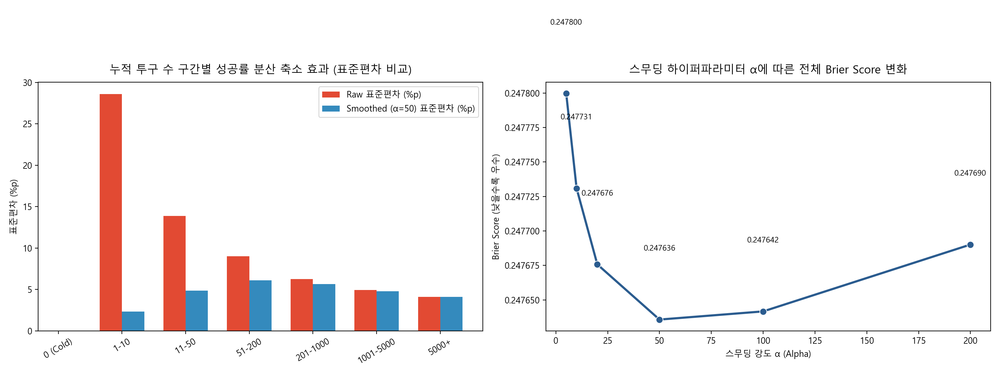
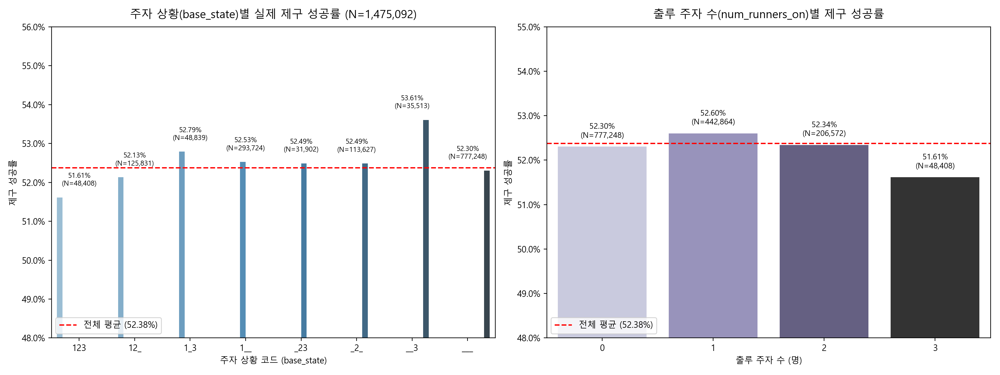
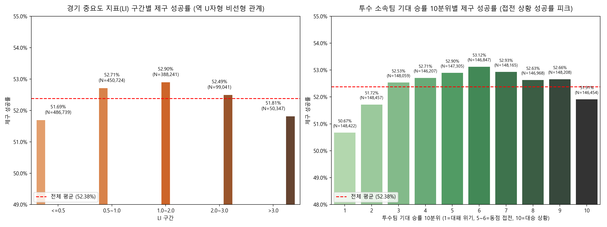
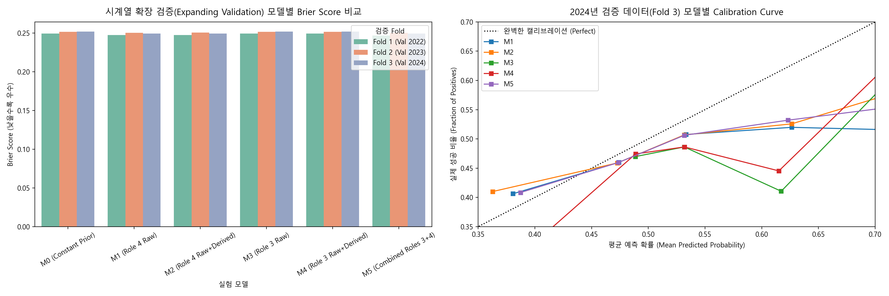

# ⚾ LG Aimers 해커톤: 투수 제구 성공 확률 예측 (Roles 3 & 4 EDA)

[](https://colab.research.google.com/github/seokjin-wq/Aimers-9th/blob/main/notebooks/LG_Aimers_EDA_roles_3_4.ipynb)
[](https://github.com/seokjin-wq/Aimers-9th)
[](https://opensource.org/licenses/MIT)

---

## 📌 1. 프로젝트 개요

- **대회명**: LG Aimers 해커톤: 투구 궤적 및 경기 상황 기반 투수 제구 성공 확률 예측
- **대회 공식 페이지**: [DACON LG Aimers 공식 페이지](https://dacon.io/competitions/official/236743/overview/description)
- **예측 대상 (`control_success`)**:
  각 투구 시점에서 투수가 의도한 위치 또는 허용 범위 안으로 투구하였는지를 나타내는 이진 타깃(`1`=성공, `0`=실패)에 대해 **1일 확률(사후 제구 성공 확률, $0.0 \sim 1.0$)**을 예측합니다.

---

## 📂 2. 데이터 구조 및 데이터셋 배치 안내

### 2.1 데이터셋 구성
- `train.csv`: 1,475,092행 $\times$ 49개 컬럼 (2019~2024년 정규 시즌 데이터)
- `test.csv`: 로컬 배포본 5행 샘플 (평가 서버 제출 시 245,789행으로 자동 교체)
- `sample_submission.csv`: 제출 형식 확인용 5행 샘플
- `trackman_history.csv`: 2019~2024년 과거 Trackman 물리 궤적 로그 (1,793,078행)
- `data_description.md`: 주최측 공식 데이터 설명서

### 2.2 DACON 데이터 다운로드 및 배치 방법
대회 규정 및 용량 제한으로 원본 데이터 파일은 저장소에 포함되지 않습니다. [DACON 대회 페이지](https://dacon.io/competitions/official/236743/overview/description)에서 `open.zip`을 다운로드한 후 다음과 같이 배치해주세요.

```text
Aimers-9th/
├── data/
│   ├── train.csv
│   ├── test.csv
│   ├── sample_submission.csv
│   └── trackman_history.csv
│   (또는 프로젝트 루트에 open.zip 배치)
├── notebooks/
├── docs/
├── figures/
└── reports/
```

> **💡 스마트 경로 탐색 지원**:  
> 본 프로젝트의 노트북 및 스크립트는 `data/train.csv`, `../data/train.csv`, `open.zip`, Colab 환경(`/content/data/train.csv`, 구글 드라이브 마운트 경로), 환경변수 `DATA_DIR`을 자동으로 탐색하여 로드합니다.

---

## 🎯 3. 분석 범위 (담당 3·4 변수 그룹)

본 분석은 전체 49개 피처 중 투수의 과거 누적 이력(담당 4)과 주자 상황 및 경기 중요도(담당 3)를 집중 분석합니다.

### ⚾ 담당 4 변수 (투수 과거 누적 이력 및 과거 구종 성향)
> `asof_*`는 현재 투구 결과를 포함하지 않고 **현재 투구 직전까지의 과거 기록만 누적 집계**한 사전 피처입니다.
- `asof_pitcher_n`: 투수의 과거 누적 투구 수
- `asof_pitcher_success_rate`: 과거 누적 제구 성공률 (타깃과 가장 강한 상관관계, $r = +0.0843$)
- `asof_pitcher_reverse_rate`: 의도 반대성 투구 비율 (바깥쪽 요구 $\rightarrow$ 몸쪽 투구 등, $r = -0.0795$)
- `asof_pitcher_middle_rate`: 가운데/실투성 위험 코스 투구 비율
- `asof_pitcher_ball_rate`: 볼성 결과 비율
- `asof_pitcher_strike_rate`: 스트라이크성 결과 비율
- `asof_pitcher_pitchmix_n`: 구종 비율 산출용 누적 표본 수 (`asof_pitcher_n`과 100% 동일)
- `asof_pitcher_fastball_rate`: Fastball(직구) 계열 사용 비율
- `asof_pitcher_breaking_rate`: Breaking(슬라이더/커브 등) 계열 사용 비율
- `asof_pitcher_offspeed_rate`: Offspeed(체인지업 등) 계열 사용 비율 (세 구종 합계 = 1.0)

### 🏟️ 담당 3 변수 (주자 상황 및 경기 중요도)
- `runner_on_1b`, `runner_on_2b`, `runner_on_3b`: 각 베이스별 주자 존재 여부 (0 또는 1)
- `num_runners_on`: 현재 출루 주자 수 (0~3, $1\text{B}+2\text{B}+3\text{B}$ 합계와 100% 일치)
- `base_state`: 8가지 주자 배치 코드 (`___`, `1__`, `_2_`, `__3`, `12_`, `1_3`, `_23`, `123`)
- `home_win_expectancy`, `away_win_expectancy`: 홈팀 및 원정팀 기준 투구 직전 기대 승률 (0~100, 대칭 합계 $\approx 100.0$)
- `li`: 경기 레버리지 지표 (Leverage Index, 상황 중요도)

---

## 🔍 4. 핵심 EDA 발견 및 모델링 시사점

1. **데이터 무결성 검증 (100% 통과)**:
   - `asof_pitcher_n == asof_pitcher_pitchmix_n`: 1,475,092행 전체 100% 동일 (완전 중복 변수).
   - 구종 비율 3종 합계는 정확히 1.0 (선형 모델 시 1개 기준 변수 제외 필요).
   - `home_win_expectancy`와 `away_win_expectancy`는 $r = -0.9999998$의 완전 반대 대칭 관계.
2. **Cold-Start 결측치 (792건)**:
   - 신규 투수 최초 등판 시점의 정상적 결측으로, `pitcher_cold_start` 이진 플래그를 생성하고 결측치는 학습 세트의 타깃 평균(Global Prior)으로 대체.
3. **베이지안 스무딩 (Bayesian Smoothing)**:
   - 표본 수 부족 시 극단값(0%, 100%)을 완화하기 위해 $M = \frac{\text{success\_count} + \alpha \cdot \text{Prior}}{N + \alpha}$를 적용, **$\alpha=50$에서 최적의 Brier Score** 달성.
4. **비선형성 (Non-Linearity) 및 상호작용**:
   - `pitcher_team_win_expectancy`는 동점 접전(승률 50% 부근)에서 제구 성공률(53.12%)이 피크를 이룸.
   - `li`는 중간 중요도(1.0~2.0)에서 제구 성공률(52.90%)이 가장 높고 극단적 상황에서 낮아지는 역 U자형 패턴 관측.
   - 만루(`123`) 상황의 제구 성공률이 51.61%로 가장 낮음.

---

## 📊 5. 주요 분석 시각화 미리보기

| 시각화 분석 항목 | 그래프 미리보기 |
|---|---|
| **타깃 분포 및 시즌별 시계열 드리프트** |  |
| **누적 성공률 10분위수별 실제 제구 성공률** |  |
| **베이지안 스무딩 α 평가 및 분산 축소 효과** |  |
| **주자 상황(base_state)별 실제 제구 성공률** |  |
| **LI 및 투수팀 기대 승률의 비선형 관계** |  |
| **시계열 확장 검증 및 Calibration Curve** |  |

---

## ⏳ 6. 시계열 확장 검증 (Expanding Time-Series Validation) 결과

미래 데이터 누수를 차단하기 위해 3-Fold 확장 검증을 수행하였습니다.

- **Fold 1**: Train (2019~2021) $\rightarrow$ Val (2022)
- **Fold 2**: Train (2019~2022) $\rightarrow$ Val (2023)
- **Fold 3**: Train (2019~2023) $\rightarrow$ Val (2024)

| 모델 구분 | 피처 세트 | Mean Brier (낮을수록 우수) | Worst Fold Brier | Mean Local BSS | Mean ROC-AUC |
|---|---|---|---|---|---|
| **M5** | **담당 3·4 결합 전체 (Raw + 파생)** | **0.248920** | **0.250462** | **357.32** | **0.5376** |
| **M1** | 담당 4 원본 변수 (10종) | 0.249147 | 0.250462 | 266.42 | 0.5357 |
| **M2** | 담당 4 원본 + 파생변수 | 0.249211 | 0.250606 | 259.84 | 0.5353 |
| **M0** | 기준 모델 (학습 Fold 상수 Prior) | 0.250936 | 0.251875 | 0.00 | 0.5000 |
| **M3** | 담당 3 원본 변수 (8종) | 0.250960 | 0.251843 | 0.00 | 0.5068 |
| **M4** | 담당 3 원본 + 파생변수 | 0.250974 | 0.251828 | 0.00 | 0.5066 |

> **검증 결론**: 담당 4 변수가 핵심 예측력을 견인하며, 담당 3 변수와의 상호작용 피처가 결합된 **M5 모델이 전 Fold 최고 성능(Mean Brier 0.248920, Local BSS 357.32)**을 달성하였습니다.

---

## 🛡️ 7. 엄격한 데이터 누수(Data Leakage) 방지 원칙

1. **평가 데이터 독립성**: `test.csv` 내부의 다른 행을 참조한 빈도, rolling, expanding, target encoding 전면 배제.
2. **사전 지표 준수**: 모든 누적 이력(`asof_*`)은 현재 투구 직전 시점까지의 기록만 반영.
3. **검증 Fold Prior 격리**: 베이지안 스무딩 모수($\alpha=50$) 및 Prior 확률은 각 Fold의 **학습 데이터(`train_sub`)에서만 산출**하여 검증 데이터 타깃 정보의 사전 유출을 완벽 차단.

---

## 🚀 8. 실행 방법

### 8.1 로컬 환경 실행
```bash
# 1. 저장소 클론
git clone https://github.com/seokjin-wq/Aimers-9th.git
cd Aimers-9th

# 2. 필수 패키지 설치
pip install -r requirements.txt

# 3. Jupyter Notebook 실행
jupyter notebook notebooks/LG_Aimers_EDA_roles_3_4.ipynb
```

### 8.2 Google Colab 원클릭 실행
상단의 [](https://colab.research.google.com/github/seokjin-wq/Aimers-9th/blob/main/notebooks/LG_Aimers_EDA_roles_3_4.ipynb) 배지를 클릭하면 Colab에서 즉시 열람 및 실행할 수 있습니다.

---

## 📁 9. 디렉토리 구조 및 관련 문서

```text
├── .gitignore                          # 대용량 데이터 및 모델 가중치 제외
├── README.md                           # 프로젝트 가이드 및 결과 요약
├── requirements.txt                    # 의존성 패키지 명세
├── docs/                               # 원본 보존 Notion EDA PDF 파일
│   ├── 3번_EDA.pdf                     # 주자 상황 및 경기 중요도 기존 분석 PDF
│   └── 4번_EDA.pdf                     # 투수 누적 이력 기존 분석 PDF
├── notebooks/
│   └── LG_Aimers_EDA_roles_3_4.ipynb   # Colab/로컬 호환 전체 분석 및 검증 주피터 노트북
├── figures/                            # 10개 고해상도(200 DPI) 시각화 PNG 차트
│   ├── fig01_target_distribution_and_season_trend.png
│   ├── fig02_pitcher_cumulative_pitches_distribution.png
│   ├── fig03_role4_rate_variables_distribution.png
│   ├── fig04_role4_correlations_and_target_association.png
│   ├── fig05_success_rate_deciles_vs_target.png
│   ├── fig06_smoothing_and_cold_start_analysis.png
│   ├── fig07_role3_runner_situations_and_success_rate.png
│   ├── fig08_role3_win_expectancy_and_li_distributions.png
│   ├── fig09_role3_li_and_win_expectancy_vs_target.png
│   └── fig10_model_validation_comparison_and_calibration.png
└── reports/
    ├── EDA_summary_roles_3_4.md        # 데이터 사이언티스트 심층 분석 보고서
    ├── table_01_data_quality.csv       # 데이터 품질 및 결측 점검표
    ├── table_02_role4_descriptive_stats.csv # 담당 4 기술통계표
    ├── table_03_role4_target_correlations.csv # 담당 4 타깃 상관계수표
    ├── table_04_base_state_stats.csv   # 주자 상황별 제구 성공률 및 신뢰구간
    ├── table_05_runners_count_stats.csv # 주자 수별 제구 통계표
    ├── table_06_role3_descriptive_stats.csv # 담당 3 기술통계표
    ├── table_07_smoothing_analysis.csv # 베이지안 스무딩 평가표
    ├── table_08_expanding_validation_results.csv # 시계열 확장 검증 상세 결과표
    └── table_09_model_summary_metrics.csv # 모델 종합 요약표
```

### 🔗 주요 바로가기
- 📓 [분석 노트북: LG_Aimers_EDA_roles_3_4.ipynb](notebooks/LG_Aimers_EDA_roles_3_4.ipynb)
- 📑 [심층 보고서: EDA_summary_roles_3_4.md](reports/EDA_summary_roles_3_4.md)
- 📄 [기존 노션 PDF (주자 및 경기 중요도): 3번_EDA.pdf](docs/3번_EDA.pdf)
- 📄 [기존 노션 PDF (투수 누적 이력): 4번_EDA.pdf](docs/4번_EDA.pdf)

---

## 📈 10. 향후 모델링 로드맵

1. **Trackman 물리 피처 결합**: 릴리스 포인트, 회전수, 수직/수평 무브먼트 통계와 담당 3·4 변수 통합.
2. **시계열 드리프트 적응**: 2019~2024년 시즌별 제구 성공률 하락 추세 보정을 위한 가중치 또는 Decay 기법 적용.
3. **앙상블 및 캘리브레이션**: LightGBM, CatBoost, XGBoost 앙상블 및 Isotonic / Platt Scaling 확률 보정.
