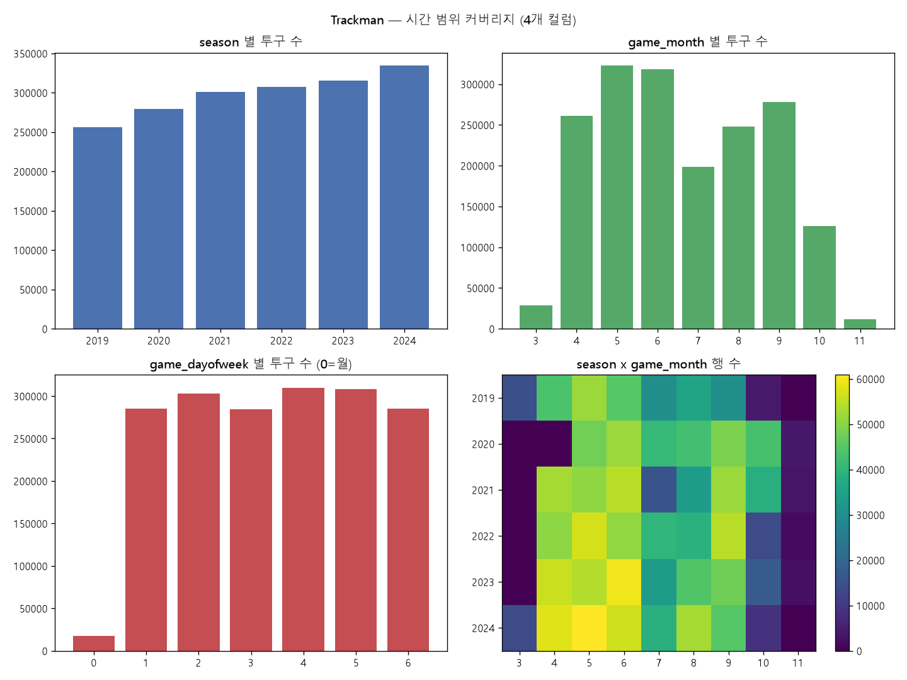
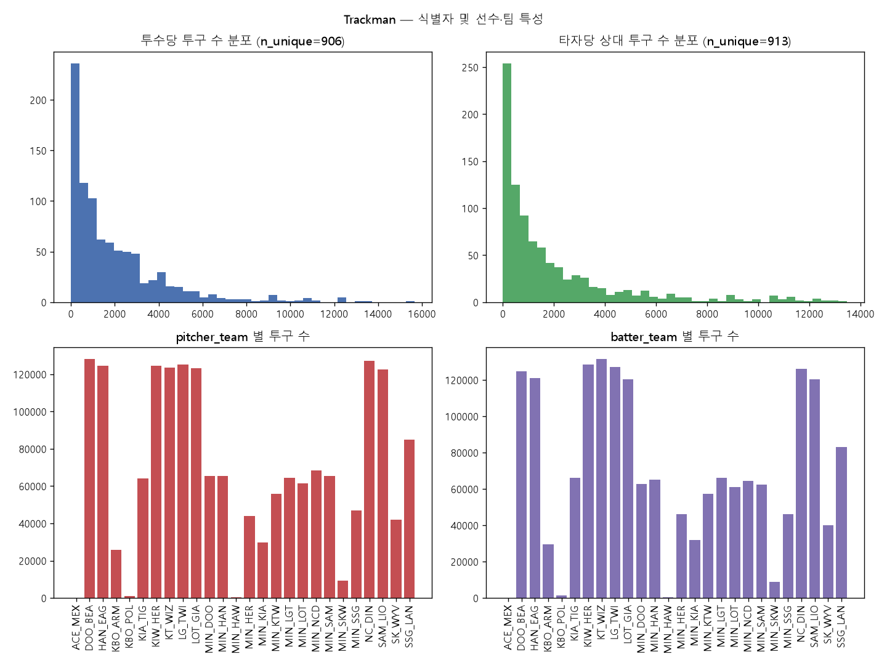
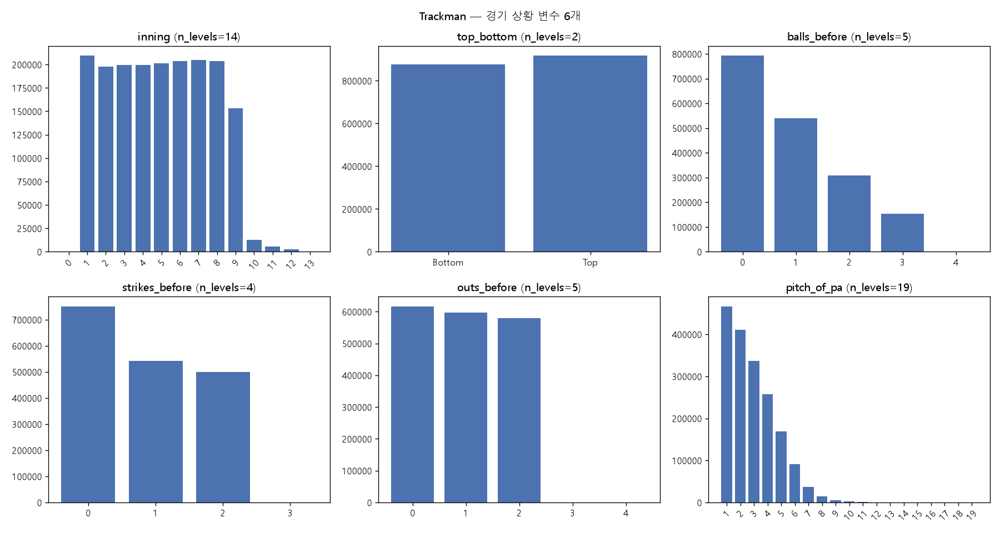
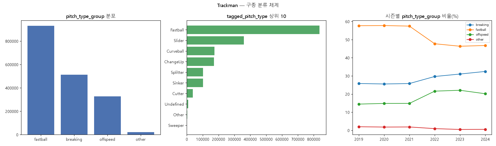
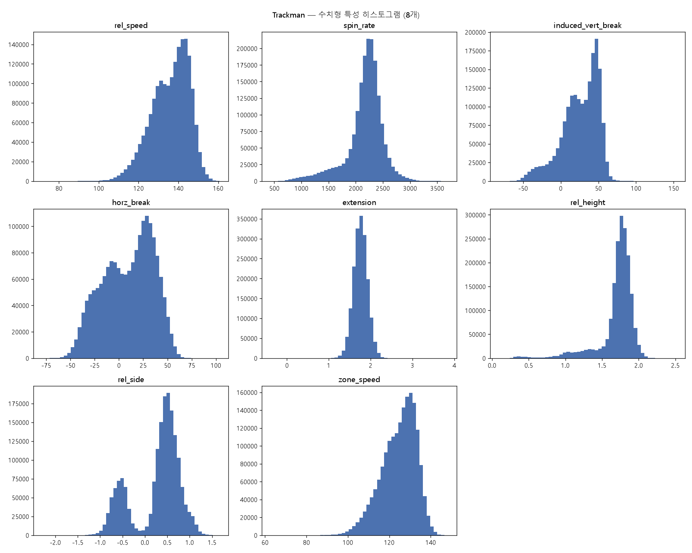
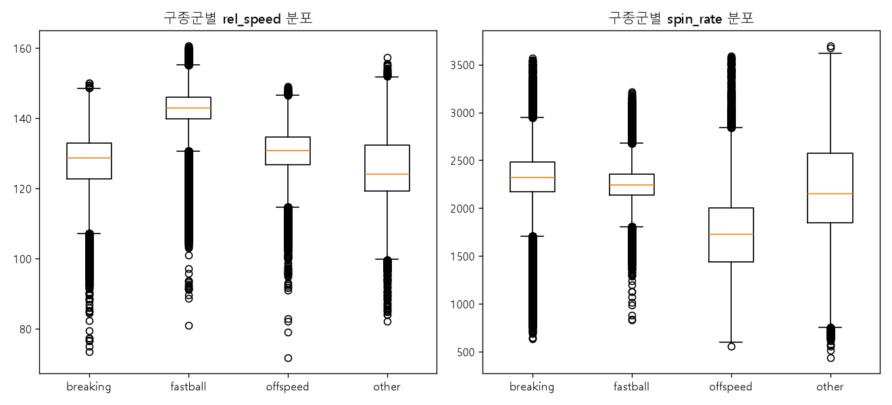
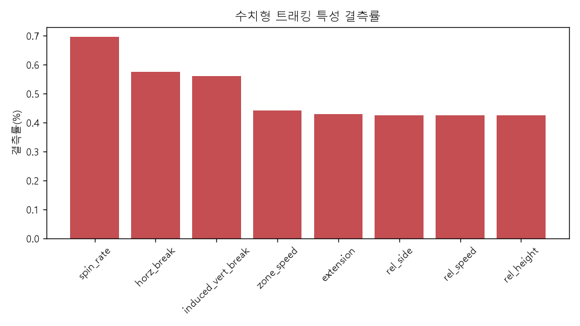
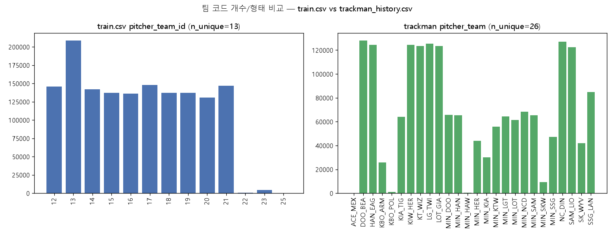

# Trackman 기본 EDA — `data/trackman_history.csv`

30개 컬럼을 6개 그룹(시간정보 4 / 식별자 5 / 손유형·팀 4 / 경기상황 6 / 구종분류 3 /
수치형 트래킹특성 8)으로 묶어 살펴본 **기본·필수 수준의 EDA**다. 팀 회의에서
"트랙맨 기본 탐색은 양적으로 충분히 했다"고 어필할 수 있도록, 컬럼 조합별로
목적·방법·결과·시사점을 구분해 정리했다.

실행 코드는 [`run_eda.py`](run_eda.py) (재실행: `python reports/eda_trackman/run_eda.py`,
실행 로그 원본은 [`eda_run_log.txt`](eda_run_log.txt)). 이 문서의 모든 수치는
그 로그와 `tables/*.csv`에서 그대로 가져왔다 — 추정치는 없음.

데이터: `data/trackman_history.csv` (2019~2024, 1,793,078행×30컬럼). §8에서만
`data/train.csv`의 ID 비교용 컬럼 4개를 추가로 읽었다. `trackman_history.csv`는
`train.csv`/`test.csv`와 1:1로 결합되는 테이블이 아니므로(`docs/data_description.md`
§3), 이 EDA에서 나온 어떤 집계값도 그대로 test.csv 피처로 옮기지 않는다 — 실제
피처화 시에는 반드시 season/game_month 기준 as-of 컷오프가 필요하다(CLAUDE.md 규칙 10).

> **참고**: 이전 세션에서 이미 한 차례 더 복잡한 trackman EDA(교차분석 위주)를
> 진행한 바 있다. 그 산출물(`README.md`, `MEETING_REVIEW.md`, 표/그림)은
> [`reports/eda_trackman_v1_archive/`](../eda_trackman_v1_archive/)로 그대로
> 옮겨 보존했다 — 필요하면 그쪽을 참고하면 된다. 이 문서는 그것과 별개로, 더
> 기본적인 단변량·구조 중심 EDA를 처음부터 새로 진행한 결과다.

---

## 1. 데이터 품질/구조 확인

**목적**: 30개 컬럼의 dtype·결측치·unique 개수를 파악하고, 이후 분석 전에 명백한
이상치나 무결성 문제가 있는지 먼저 점검한다.

**방법**: 컬럼별 dtype/결측률/unique 수/min·max 요약표
([`00_quality_summary.csv`](tables/00_quality_summary.csv)), 완전 중복행 및
`trackman_id` 중복 여부 확인.

**결과**: 1,793,078행 × 30컬럼. 결측치는 수치형 트래킹 특성 8개 컬럼에서만
발생하며(0.42~0.70%), 나머지 22개 컬럼(시간/식별자/상황/구종분류)은 결측 0건.
완전 중복행 0건, `trackman_id` 중복 0건(행 고유 식별자로 타당). `balls_before`
(0~4), `strikes_before`(0~3), `outs_before`(0~4)에서 야구 규칙상 불가능한
값이 극소수 존재(§4에서 상세).

**시사점**: 전반적으로 데이터 품질은 양호하다(결측 1% 미만, 중복 없음). 다만
카운트 컬럼의 규칙 위반 값은 팀 단위 집계 전에 필터링하는 것이 안전하다.

---

## 2. 시간 범위 커버리지

**목적**: trackman 로그가 2019~2024 전체 시즌을 얼마나 고르게 커버하는지,
train.csv와 시계열상 정합성이 있는지 확인한다.

**방법**: `season`/`game_month`/`game_dayofweek` 단변량 집계 + `season x
game_month` 히트맵을 2x2 그리드로 함께 시각화. `game_date`를 날짜형으로
파싱해 `game_month`와 교차 검증.

**결과**:
- season별 행 수는 25.6만(2019)~33.4만(2024)로 매년 증가 추세이며 전체 시즌을
  고르게 커버한다.
- **`game_date` 형식이 시즌 중간에 바뀐다** — 2019~2021년은 `MM/DD/YYYY`,
  2022~2024년은 `YYYY-MM-DD`(ISO). 이 EDA에서도 처음에 단일 포맷(`%m/%d/%Y`)
  으로만 파싱을 시도했다가 **956,963행(53.4%)이 조용히 파싱 실패(NaT)** 하는
  것을 실제로 경험했다 — 형식을 슬래시/하이픈으로 분기해서 재파싱하니 파싱
  실패 0건, `game_date`에서 뽑은 월과 공식 `game_month` 컬럼의 일치율
  100.0000%로 완전히 맞아떨어졌다.
- season x game_month 히트맵에서 **2020~2023년은 3월 데이터가 0건**이고
  2019년과 2024년만 3월 데이터가 있다 — `train.csv` EDA(`reports/eda_group1`
  §4)에서 이미 확인된 "2020~2023년 3월 결측" 현상과 정확히 일치한다(교차 검증됨).

**시사점**:
1. `game_date`를 직접 파싱하는 코드를 짤 때는 반드시 시즌별 포맷 분기 처리가
   필요하다 — 그렇지 않으면 절반 가까운 데이터가 조용히 깨진다(이번에 직접
   재현·수정한 함정이므로 팀 코드에 그대로 반영해야 함).
2. 시즌 초반(3월) 데이터가 대부분 시즌에서 아예 없으므로, season 초반 시점의
   as-of 트랙맨 피처는 표본 부족(cold-start)이 특히 심할 수 있다.

---

## 3. 식별자 및 선수·팀 특성

**목적**: 트랙맨 고유 ID들의 무결성을 확인하고, 선수 단위 표본 크기 및
`pitcher_team`/`batter_team` 코드 구조(팀 단위 조인 후보)를 파악한다.

**방법**: ID별 unique/min/max 표([`03_id_summary.csv`](tables/03_id_summary.csv)),
투수/타자당 투구 수 분포(히스토그램), 팀 코드별 투구 수 집계를 2x2 그리드로
시각화.

**결과**:
- `trackman_id`는 1~1,793,078로 100% 고유(행 식별자로 타당).
- `pitcher_trackman_id` 906명(범위 50,008~71,775,155), `batter_trackman_id`
  913명(범위 50,007~93,595,155). 투수당 투구 수 중앙값 1,150구(2~15,671구),
  타자당 상대 투구 수 중앙값 932구(1~13,460구).
- **`pitcher_team`/`batter_team`이 각각 26개 코드**로 확인됐다
  ([`03_pitcher_team_counts.csv`](tables/03_pitcher_team_counts.csv)). 코드
  목록을 보면 `DOO_BEA`(41,895~208,662구 규모의 10개, 실제 KBO 구단 약자로
  보임 — 익명화되지 않은 것으로 추정)와, 그 절반 정도 규모인
  `MIN_DOO`/`MIN_HAN`/`MIN_KIA`/`MIN_KTW`/`MIN_LGT`/`MIN_LOT`/`MIN_NCD`/
  `MIN_SAM`/`MIN_SSG`/`MIN_HER`/`MIN_SKW`(9,215~68,421구 규모, 12개)로
  뚜렷이 나뉜다. `MIN_` 접두사를 뗀 나머지(`DOO`, `HAN`, `KIA`, `KTW`,
  `LGT`, `LOT`, `NCD`, `SAM`, `SSG`, `HER`, `SKW`)가 앞의 "주력" 코드 접미부와
  1:1로 짝을 이룬다. `ACE_MEX`(152구), `KBO_ARM`(25,776구), `KBO_POL`
  (902구), `MIN_HAW`(292구)는 규모가 작은 특수 코드다.

**시사점**: `pitcher_team` 26개 코드는 "1군 팀 10~11개 + 2군/기타 코드
15개"의 혼합으로 보인다(정확한 의미는 공식 문서에 없어 단정하지 않고
관찰된 명명 패턴에 기반한 가설로 표시). 팀 단위 트랙맨 피처를 만들려면
**1군 경기에 해당하는 팀 코드만 먼저 선별하는 필터링이 선행**되어야 한다 —
안 그러면 2군/기타 리그 투구가 1군 팀 특성에 섞여 들어간다.

---

## 4. 경기 상황 변수

**목적**: `inning`/`top_bottom`/`balls_before`/`strikes_before`/`outs_before`/
`pitch_of_pa` 6개 컬럼의 분포를 확인하고, 야구 규칙상 비정상적인 값이 있는지
점검한다.

**방법**: 6개 컬럼을 2x3 그리드로 묶어 단변량 막대그래프로 시각화.

**결과**:
- `inning` 0~13(0은 1건뿐인 이상치, 연장 11~13회는 표본이 급격히 작아짐).
- `top_bottom`은 Top 916,993 / Bottom 876,085로 대체로 균등.
- **`balls_before`가 4를 가지는 행 1건**(규칙상 0~3이어야 함),
  **`strikes_before`가 3을 가지는 행 1건**(규칙상 0~2), **`outs_before`가
  3(83건)·4(12건)를 가지는 행 95건**(규칙상 0~2) — `train.csv`의
  `eda_group2`가 확인한 "0~3/0~2/0~2가 유효 범위"와 동일한 논리로 명백한
  규칙 위반값이다.
- `pitch_of_pa`는 1구가 466,163건으로 최다이고 타석 진행에 따라 자연스럽게
  감소하는 형태(최대 19구까지 관측).

**시사점**: 규칙 위반 값은 179만행 중 97건(0.005%)으로 극소수라 전체
분석에 미치는 영향은 미미하지만, 팀/선수 단위로 집계하기 전에 이런 행을
걸러내거나 별도 플래그를 다는 것이 안전하다.

---

## 5. 구종 분류 체계

**목적**: `tagged_pitch_type`(태깅)·`auto_pitch_type`(자동분류)·
`pitch_type_group`(4분류) 세 컬럼의 관계와 신뢰도, 시즌별 트렌드를 확인한다.

**방법**: 3개 컬럼 각각 value_counts, `tagged_pitch_type == auto_pitch_type`
정확 일치율 계산 후 계열(패스트볼/브레이킹/오프스피드/기타) 단위로 재분류해
일치율 재계산(크로스탭 기반), 시즌별 `pitch_type_group` 비율 트렌드를 1x3
그리드로 시각화.

**결과**:
- `tagged_pitch_type` 17종(오타/표기 흔들림 존재: `SInker` 38건, `Undefind`
  1건, `Undefined#` 1건 등), `auto_pitch_type` 11종, `pitch_type_group`은
  `fastball`(931,120) / `breaking`(512,851) / `offspeed`(326,809) /
  `other`(22,298) 4종으로 항상 깔끔하게 정리되어 있다.
- `tagged_pitch_type == auto_pitch_type` **정확 문자열 일치율은 55.06%**로
  낮아 보이지만, 라벨 세분화 차이가 주 원인이다 — 예를 들어 `tagged`는
  패스트볼을 전부 `Fastball`로 뭉뚱그리는데(835,886구) `auto`는
  `Fastball`/`Four-Seam`으로 세분화하며, `tagged=Fastball`인 835,886구 중
  696,400구(83.3%)가 `auto`에서 `{Fastball, Four-Seam}` 중 하나로 분류됐다.
  패스트볼/브레이킹/오프스피드 **계열 단위로 재분류하면 일치율이 91.63%까지
  상승**한다.
- 시즌별 `pitch_type_group` 비율은 2019~2021년(`fastball` 57.5~57.8%,
  `breaking` 25.6~25.8%)에서 2022~2024년(`fastball` 46.4~47.7%, `breaking`
  29.7~32.5%)으로 뚜렷이 이동한다 — 브레이킹볼 비중이 커지는 추세.

**시사점**: 파생 피처를 만들 때는 원본 `tagged`/`auto_pitch_type`보다 이미
정제된 `pitch_type_group`(4분류)을 기본으로 쓰는 것이 안전하다 — 공식
`asof_pitcher_fastball/breaking/offspeed_rate`와 **동일한 분류 체계**라 바로
호환된다. 2022년을 기점으로 리그 전체 구종 구성이 바뀐 것으로 보이므로,
트랙맨 기반 "구종 성향" 피처는 반드시 시즌 단위로 만들어야 하고 전체 기간
평균으로 뭉치면 이 트렌드를 놓친다.

---

## 6. 수치형 트래킹 특성 분포

**목적**: 구속·회전수·무브먼트·릴리스 포인트 등 8개 수치형 컬럼의 분포와
구종군별 차이를 확인한다.

**방법**: `describe()` 통계표, 8개 컬럼 히스토그램을 3x3 그리드로 시각화,
`pitch_type_group`별 `rel_speed`/`spin_rate` boxplot을 1x2 그리드로 시각화.

**결과**:
- `rel_speed` 평균 135.96km/h(71.68~160.66), `spin_rate` 평균 2169.97rpm
  (434.9~3695.92).
- 구종군별로 뚜렷이 구분된다 — `fastball` 평균 142.70km/h / 2241.98rpm,
  `breaking` 평균 127.53km/h / **2334.98rpm(회전수는 오히려 fastball보다
  높음)**, `offspeed` 평균 130.47km/h / **1708.29rpm(회전수 가장 낮음)**.
- `extension` 평균 1.76m, `rel_height` 평균 1.70m, `rel_side` 평균 0.26m.

**시사점**: 구종군별 구속·회전수 패턴이 일반적으로 알려진 투구 특성
(브레이킹볼 계열은 회전수가 높고, 체인지업/스플리터 계열은 회전수가 낮음)과
방향이 일치해 데이터 신뢰도가 높아 보인다. 공식 `asof_pitcher_fastball_rate`
같은 "비율" 피처를 보완해, "그 구종의 평균 구속/회전수 자체" 같은 강도
(intensity) 정보를 추가하면 기존 피처가 담지 못하는 정보를 더할 수 있는
후보로 보인다.

---

## 7. 결측치·이상치 점검

**목적**: 8개 수치형 컬럼의 결측 패턴(행 단위인지 컬럼별 개별 발생인지)과
극단값 비율을 정량화한다.

**방법**: 결측률 막대그래프, 0.1%/99.9% 분위수 기준 극단값 비율(공식 문서에
물리적 유효범위가 명시되어 있지 않아 고정 임계값 대신 분위수 기준 사용 —
CLAUDE.md의 "근거 없는 가정 금지" 원칙에 따름), 8개 컬럼 결측 여부의 행
단위 co-occurrence를 별도로 확인.

**결과**:
- 결측률은 `spin_rate`가 가장 높고(0.695%) `rel_speed`/`rel_height`가 가장
  낮다(0.425%) — 8개 컬럼 모두 0.42~0.70% 수준으로 비슷하게 낮다.
- 결측이 있는 행은 총 15,568행(전체의 0.868%)이며, 이 중 **7,617행(48.9%)은
  8개 컬럼이 전부 결측**(해당 투구의 트래킹 자체가 통째로 실패한 것으로
  추정)이고, **나머지 7,951행(51.1%)은 일부 컬럼만 결측**(센서별로 부분
  실패)이다 — 완전히 행 단위 이벤트도, 완전히 컬럼별 독립 이벤트도 아닌
  혼합 패턴.
- 극단값(0.1%/99.9% 분위수 밖) 비율은 8개 컬럼 모두 0.20% 내외로 균일하다.
  `extension` 최소값이 -0.387(음수, 물리적으로 불가능해 보임), `rel_height`
  최소값 0.097m(비정상적으로 낮음) 등 일부 이상치가 존재한다
  ([`07_extreme_value_check.csv`](tables/07_extreme_value_check.csv)).

**시사점**: 결측/극단값 비율이 모두 1% 미만으로 작아 팀/리그 단위 집계에는
자연스럽게 희석되므로 특별한 처리 없이 `dropna` 후 집계해도 무방해 보인다.
개별 투구 단위로 피처를 쓸 계획이 있다면 별도의 결측/이상치 처리(제외 또는
median 대체)가 필요하다.

---

## 8. train.csv 연결 가능성 재확인

**목적**: 트랙맨과 `train.csv`를 잇는 조인 키가 실제로 있는지, 특히 팀 코드
수준에서 연결 가능성이 있는지 표·그림과 함께 정식으로 재확인한다.

**방법**: `pitcher_id`/`batter_id`(train) vs `pitcher_trackman_id`/
`batter_trackman_id`(trackman) 값 범위 비교, `pitcher_team_id`(train, 13개)
vs `pitcher_team`(trackman, 26개) 개수·형태를 1x2 그리드로 비교.

**결과**:
- `train.pitcher_id`는 792명(20,700~24,633 범위), `trackman.pitcher_trackman_id`
  는 906명(50,008~71,775,155 범위) — **값 자체가 겹치지 않는 별도 공간**이다
  (공식 문서의 "직접 조인 키 없음"과 일치).
- `train.pitcher_team_id`는 13개 코드(숫자 12~25)이며, 이 중 10개가
  130,574~208,662구 규모의 "주력" 팀이고 3개(팀 22/23/25)는 292~4,437구의
  소표본 특수 코드다. `trackman.pitcher_team`은 26개 코드로 train보다
  2배 많다(§3 참고).

**시사점**: 선수 단위 직접 조인은 (값 범위상) 불가능하다는 것을 다시 한 번
확인했다. 팀 단위도 단순히 "코드 개수가 다르다"는 이유로 바로 매칭할 수는
없다 — §3에서 관찰한 "`MIN_` 접두사가 2군/특수 리그일 가능성" 가설이 맞다면,
1군에 해당하는 10~11개 코드만 추렸을 때 train의 10개 주력 코드와 규모
스케일이 비교 가능해진다. 다만 trackman 팀 코드는 실제 구단 약자로 보이는
반면(익명화 안 됨) train 팀 코드는 숫자로 익명화되어 있어 **값으로 직접
매칭할 수 없고**, 매칭하려면 두 데이터셋에서 독립적으로 계산 가능한 지표
(예: 시즌별 표본 수 순위·트렌드)를 비교하는 간접 검증이 필요하다. 이번
EDA는 "직접 매칭 불가 + 후보 좁히기"까지만 확인했고, 실제 매핑 검증은
§9(다음 단계)로 남긴다.

---

## 9. Feature Engineering 인사이트 및 다음 단계

> **먼저 확인해야 할 선행 사실**: 이 기본 EDA와 별개로, 이전 세션에서 이미
> `season`+`game_month` 기준 as-of 조인 인프라(`src/trackman_features.py`)를
> 구현하고 그 위에서 만든 4개 트랙맨 파생 피처(같은 손 매치업별 breaking
> 비율, 3볼 상황 fastball 비율/평균 구속, 리그 전체 breaking 비율)를
> `exp_005`로 실제 모델에 붙여 검증까지 완료했다 — **전체 번들 및 두
> 하위 그룹 모두 exp_003(723.17) 대비 -19.96 ~ -10.39점으로 전부 기각**
> (`experiments/exp_005_trackman.md`). 조인 메커니즘 자체(콜드스타트 비중
> 0.9%)는 문제가 아니었고, importance가 높았던 피처(4~5위)조차 검증 성능은
> 오히려 깎았다 — "EDA 신호가 뚜렷하다"와 "검증 성능이 좋아진다"가 별개임을
> 이미 데이터로 확인한 상태다. 아래 제안은 이 결과를 전제로, **exp_005가
> 다루지 않은 각도**에 집중한다.

1. **팀 단위 필터링/매핑은 exp_005가 다루지 않은 새로운 각도다.** exp_005의
   4개 피처는 전부 `season`+`game_month`(+`same_hand_matchup`/`three_ball`)
   단위였고 **팀(`pitcher_team`/`batter_team`) 정보는 전혀 쓰지 않았다.**
   §3/§8에서 새로 확인한 "trackman 26개 팀 코드 중 1군 10~11개만 필터링
   → train의 13개 `pitcher_team_id`와 간접 지표(시즌별 표본 수·트렌드)로
   매핑 검증"은 exp_005와 겹치지 않는, 아직 시도되지 않은 방향이다. 다음
   실험은 `exp_005`가 아니라 **`exp_006`**으로 번호를 이어야 한다(exp_005는
   이미 존재/기각 기록됨).
2. **exp_005 재탕이 되지 않도록, "리그 전체 as-of 피처"를 새로 제안하지
   않는다.** 이 절 초안에서는 "`season`+`game_month` 기준 리그 전체 as-of
   피처부터 시작"을 첫 제안으로 썼으나, 이는 exp_005가 이미 시도해서 기각한
   것과 사실상 동일한 접근이라 삭제했다 — 실험 기록을 먼저 확인하지 않고
   이 절을 쓰면 이런 재탕 제안이 나올 수 있다는 것 자체가 교훈이다.
3. **정칙화 원칙은 exp_005의 "다음 가설"을 그대로 따른다.** exp_005는
   원시 비율/평균값을 그대로 넣는 대신 (a) 더 강하게 shrink한 값이나
   PCA 등 저차원 요약, 또는 (b) 트랙맨 전용 보조 모델의 예측값 하나만
   메인 피처로 넣는 스태킹 방식을 다음 가설로 제시했다. 팀 단위 피처를
   새로 시도할 때도 raw `team_rate`를 직접 넣기보다 이 원칙을 적용하는
   것이 과적합 재발을 막을 가능성이 높다.
4. **"비율"이 아니라 "강도(intensity)"는 여전히 미검증 각도다.** exp_005의
   4개 피처는 전부 "비율"(breaking_rate, fastball_rate)이었고, §6에서 확인한
   "구종군별 평균 구속/회전수" 같은 강도 지표는 아직 시도되지 않았다. 다만
   exp_005의 교훈(raw 값을 직접 넣으면 과적합)을 감안하면, 이 역시 3번의
   정칙화 없이 원시 평균값을 그대로 넣는 방식은 같은 실패가 재현될 위험이
   있다.
5. **시간 누수 방지 원칙 재확인.** train에는 정확한 `game_date`가 없어
   (`season`+`game_month`까지만 존재) 일 단위 as-of 컷오프는 원천적으로
   불가능하다 — `season`+`game_month` 기준 "이전 달까지"가 현실적으로 낼 수
   있는 최대 정밀도다(§2 시사점과 동일 원칙, `src/trackman_features.py`가
   이미 이 방식으로 구현되어 있음). 이 EDA에서 나온 시즌/월 집계 수치를
   그대로 test 피처에 대입하면 안 되고, 반드시 as-of 함수로 다시 계산해야
   한다(CLAUDE.md 규칙 10).
6. **`game_date` 파싱 시 포맷 분기 필수.** §2에서 실제로 겪은 함정 — 다만
   `src/trackman_features.py`는 `game_date`를 직접 파싱하지 않고 이미
   `season`/`game_month` 컬럼을 그대로 쓰므로 이 함정과는 무관하다. 향후
   `game_date`를 직접 다루는 코드를 새로 짤 때만 해당하는 주의사항이다.
7. **트랙맨 자체가 여전히 최선의 다음 투자처가 아닐 수 있다.** exp_005는
   "현재로선 exp_003(723.17)이 최선이며, 트랙맨보다 저비용 고효율일 수
   있는 다른 방향(하이퍼파라미터 튜닝, 앙상블 등)을 먼저 검토하는 게
   나을 수 있다"고 결론지었다. 이번 기본 EDA로 팀 단위라는 새 각도를
   찾긴 했지만, 이미 한 차례 트랙맨 전체가 기각된 상태이므로 우선순위
   판단은 팀 회의에서 다시 논의가 필요하다.

---

## 작성 원칙

- 이 문서의 모든 수치는 `eda_run_log.txt`와 `tables/*.csv`에서 실제 실행된
  값만 사용했다 — 추정치 없음.
- `data/` 원본 파일은 수정하지 않았다.
- 공식 문서에 근거가 없는 항목(예: 팀 코드의 정확한 의미, 수치형 컬럼의
  물리적 유효 범위)은 "확인된 사실"이 아니라 "관찰된 패턴/가설"로 명확히
  구분해서 서술했다.
- 이 EDA에서 나온 집계값(시즌/월/팀 단위 평균 등)을 그대로 test.csv 피처로
  옮기지 않는다 — 실제 피처화 시에는 반드시 as-of 컷오프를 적용한다.
